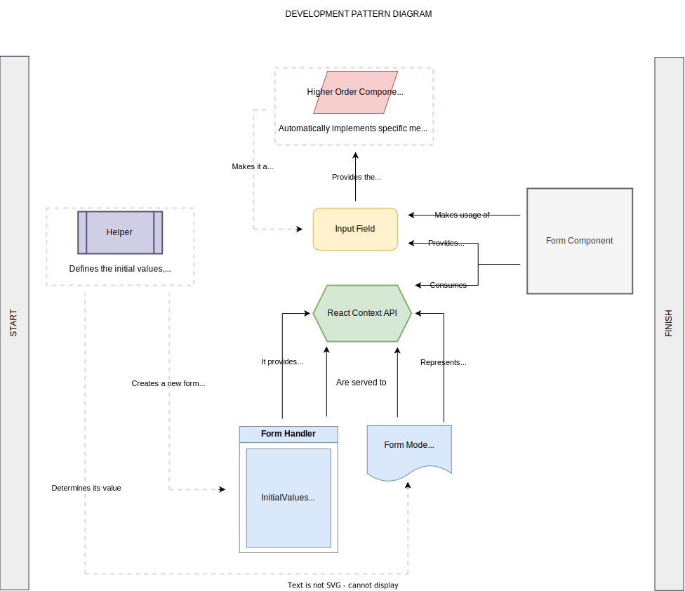

This Custom Hook was created with the intention of providing developers with a
sample on how to implement a form handler efficiently, easing out sharing the
state among inputs, managing the form state, data submission to a service and
data loading within that same form instance; all of it with the help of React
Context API and [React Hook Form](https://react-hook-form.com/). For the moment,
to make a schema builder for runtime value parsing and validation, we have
support for [Yup](https://github.com/jquense/yup).

## How to implement a form?

1. Create the React Context to serve as the global state for your form

```TypeScript
import { createContext, useContext } from 'react';

import type { DemoFormSchema, FormContext } from 'path/to/interfaces';

/**
 * Context for managing the state and operations related to a demo form.
 *
 * This context provides a shared state and functions for managing form data
 * and operations in the demo form component.
 */
export const DemoFormContext = createContext<FormContext<DemoFormSchema>>(
  {} as never,
);

/**
 * Hook to access the demo form context.
 *
 * This hook allows components to consume the `DemoFormContext` and
 * access the state and functions provided for managing the demo form.
 *
 * @returns The context value, including state and operations for managing
 * the demo form.
 */
export const useDemoFormContext = (): FormContext<DemoFormSchema> =>
  useContext(DemoFormContext);
```

2. Create a hook which will serve as a central place to define:
     - Initial values
     - Mode (create or update, and the logic driving this behaviour)
     - ValidationSchema
     - onSubmit Callback
     - Current value of the Form Context
     - Form Handler Instance

_**IMPORTANT**: Make sure to import the hook 'useFormHandler' in it so you can create a new form instance, which will be expecting the 'initialValues', 'validationSchema' and 'onSubmit' callback._


```TypeScript
import { useMemo, useState } from 'react';
import type { FieldErrors } from 'react-hook-form';
import * as yup from 'yup';

import { useFormHandler } from 'path/to/hooks';
import type { FormMode, UseFormHelperReturn, DemoFormSchema } from 'path/to/interfaces';

/**
 * Custom hook for handling a demo form. It provides the form handler and
 * context value for the form.
 *
 * @returns An object containing the form handler and context value for the
 * demo form.
 *
 * @example
 * ```tsx
 * import { useDemoForm } from './path/to/useDemoForm';
 * import { DemoFormContext } from './path/to/DemoForm.context';
 * import { FormContent } from './path/to/DemoForm.component.Content';
 *
 * const Component = () => {
 *   const { contextValue } = useDemoForm();
 *
 *   return (
 *     <DemoFormContext.Provider value={contextValue}>
 *       <FormContent debugMode />
 *     </DemoFormContext.Provider>
 *   );
 * };
 * ```
 */
const useDemoForm = (): Omit<
  UseFormHelperReturn<DemoFormSchema>,
  'onError' | 'schema'
> => {
  /**
   * NOTE: Apply the logic to determine the Form Mode, which will serve to fuel
   * the right context to the local state.
   */
  const [mode] = useState<FormMode>('create');
  // eslint-disable-next-line @typescript-eslint/no-explicit-any
  const defaultValues: Record<keyof DemoFormSchema, any> = {
    name: '',
    lastName: '',
  };

  const validationSchema = yup
    .object()
    .shape<Record<keyof DemoFormSchema, yup.Schema>>({
      name: yup.string().required('This field is required'),
      lastName: yup.string().required('This field is required'),
    });

  const onSubmit = (values: DemoFormSchema) => {
    console.log('Data ', values);
  };

  const onError = (data: FieldErrors<DemoFormSchema>) => {
    console.log('Data ', data);
  };

  const formHandler = useFormHandler<DemoFormSchema>({
    defaultValues,
    schema: validationSchema,
    onSubmit,
    onError,
  });

  /** IMPORTANT: This prevents non-stable values (i.e. object identities)
   * from being used as a value for Context.Provider. */
  const contextValue = useMemo(
    () => ({
      formHandler,
      mode,
    }),
    [formHandler, mode],
  );

  return {
    defaultValues,
    onSubmit,
    formHandler,
    contextValue,
  };
};

export default useDemoForm;
```

 2. Since the internal form state will be handled by React Context API, it has to expose the properties defined on FormContext. This is a sample of how your context implementation should look like:

```TypeScript
import type { FC } from 'react';

import { FormContent } from './components';
import { DemoFormContextProvider } from './providers';

/**
 * React component representing a demo form.
 *
 * @example
 * ```tsx
 * import { DemoForm } from './path/to/DemoForm';
 *
 * const App = () => {
 *   return (
 *     <div>
 *       <h1>My App</h1>
 *       <DemoForm />
 *     </div>
 *   );
 * };
 * ```
 */
const DemoForm: FC = () => (
  <DemoFormContextProvider>
    <FormContent debugMode />
  </DemoFormContextProvider>
);

export default DemoForm;
```

 3. Make usage of the custom hook created on step 1 to access the formHandler and to be able to interact with it
 
 ```TypeScript
 import { TextField, Button } from '@cai/material';
 import styled from '@emotion/styled';
 import { Box, Typography } from '@mui/material';
 import { useDemoFormContext } from './path/to/useDemoFormContext';

import * as S from './styles';

/**
 * Renders a debug component for displaying form debug information.
 *
 * @param {Object} formHandler - The form handler object.
 * @param {Function} formHandler.debugMode - Function to enable debug mode and retrieve debug information.
 *
 * @returns {JSX.Element} The JSX element representing the debug component.
 */
const DebugComponent = <T extends FieldValues>(formHandler: UseFormReturn<T>) => {
  const { initialValues, currentState, isValid, errors, hasBeenUpdated } = formHandler.debugMode();

  return (
    <S.Box component="div">
      <Typography variant="h3">DEBUG MODE</Typography>
      <Typography component="p">
        Initial Values: {JSON.stringify(initialValues)}
      </Typography>
      <Typography component="p">
        Current State: {JSON.stringify(currentState)}
      </Typography>
      <Typography component="p">
        Valid Data: {JSON.stringify(isValid)}
      </Typography>
      <Typography component="p">
        Errors: {JSON.stringify(errors)}
      </Typography>
      <Typography component="p">
        Form Has Been Updated: {String(hasBeenUpdated)}
      </Typography>
    </S.Box>
  );
};

/**
 * Represents a component containing action buttons for the form.
 *
 * These buttons perform various actions like pre-populating the form, resetting
 * the form, and triggering form or field validation.
 *
 * @returns The JSX element representing the action buttons.
 */
export const ActionButtons = () => {
  const { formHandler } = useDemoFormContext();

  return (
    <div style={{ display: 'flex', gap: '0.5rem' }}>
      <Button
        variant="text"
        token="pre_populate_form"
        onClick={() => {
          formHandler.resetForm({
            name: 'Samuel',
            lastName: 'Rosales',
          });
        }}
      />
      <Button
        variant="text"
        token="reset_form"
        onClick={() => {
          formHandler.resetForm();
        }}
      />
      <Button
        variant="text"
        token="trigger_form_validation"
        onClick={() => {
          void formHandler.triggerValidation();
        }}
      />
      <Button
        variant="text"
        token="trigger_field_validation"
        onClick={() => {
          void formHandler.triggerValidation('name');
        }}
      />
    </div>
  );
};


/**
 * Represents a styled form container component.
 *
 * This component applies custom styles to the form element.
 */
export const FormContainer = styled(Box)(() => {
  return {
    display: 'flex',
    flexDirection: 'column',
    gap: '1rem',
  };
});


/**
 * Renders the form content with input fields and action buttons.
 *
 * @param debugMode - Determines whether to display the form in debug mode.
 *
 * @returns The JSX element representing the form content.
 */
export const FormContent = ({ debugMode = false }: FormDebugOption) => {
  const { formHandler } = useDemoFormContext();

  return (
    <FormContainer>
      <TextField
        name="name"
        token="name"
        formhandler={formHandler}
      />
      <TextField
        name="lastName"
        token="last_name"
        formhandler={formHandler}
      />
      <Button
        variant="primary"
        token="submit"
        onClick={formHandler.onSubmitHandler}
        disabled={formHandler.formState().isValid}
      />
      <ActionButtons />
      {debugMode && DebugComponent(formHandler)}
    </FormContainer>
  );
};
```

 ## SUMMARY
 In order to comply with the pattern, you will need to have:
 
 - API context to provide the local state to the form components and sub components (if it applies). It will allow the formHandler to interact with the input fields of it.
 - Hook to define the methods, logic to manage the form. You have to implement 'useFormHandler' in this file to create a new form instance so the methods to manage the form are exposed.


_**NOTE** Before thinking of using custom hook, it is required to use the HOC 'withBaseField' to enhance each input field expected to be used in the form component. It will inject an optional prop called 'formhandler' to manage the form state, through the methods returned from the `useFormHandler` hook._

The concern of updating the input value in the form state, validating, resetting it, etc. will be taken away from you, and will be done automatically by this HOC.

# How it works from the technical perspective
<div align="center">
    
</div>
